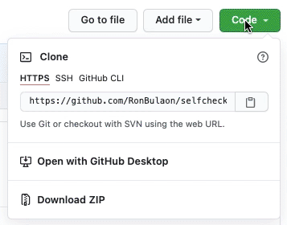

<h1>Self Checkout</h1>

This web application was presented at [IGeLU 2021 Digital Conference](https://igelu.org/archive-of-presentations/2021-digital-conference), to show how a **Two-Factor Authentication** can be integrated to a self-service kiosk without heavy integration to third-party service providers. Thus, making it secure, user friendly and at the same time minimize the possibility of other users using an account without the patron's knowledge.

Using **Django** Web Framework as backend, this web app uses **Alma APIs** to process patron fulfilment requests. Authentication is done by requiring students to provide their identification card and email access to receive one-time password (OTP).

<h2>Table of Contents</h2>
<!-- TOC -->

- [How It Looks Like](#how-it-looks-like)
- [How It Works](#how-it-works)
- [You Will Need](#you-will-need)
- [Installation](#installation)
- [Notes and Roadmap](#notes-and-roadmap)
- [Credits](#credits)
- [License](#license)

<!-- /TOC -->

## How It Looks Like


## How It Works


## You Will Need
* Access to [Alma REST](https://developers.exlibrisgroup.com/alma/apis/) API and keys.
* [Gmail](https://mail.google.com) accounts.
* [Docker](https://docs.docker.com/get-docker/)
* [Python](https://www.python.org/) with [Django](https://www.djangoproject.com/) Web Framework

## Installation 
1. Install [Docker](https://docs.docker.com/get-docker/).
2. If you have [git](https://git-scm.com/downloads) installed clone this repository like this,
   ```bash
   $ git clone https://github.com/RonBulaon/SelfCheckout.git
   ```
   or download and extract to your local machine. <br />
   

3. Once cloned/downloaded open a command line, and navigate inside the folder ```SelfCheckout```.
   ```bash
   $ cd /<path_to_folder>/SelfCheckout
   ```
4. Using a text editor, open  ```docker-compose.yml``` and change the following values to match your settings.
   ```yml
    environment:
        - EMAIL=<email@gmail.com>
        - PASSWORD=<password>
        - HOST=smtp.gmail.com   # no need to change this if using gmail.com
        - API_SERVER=https://api-ap.hosted.exlibrisgroup.com  
        - API=<your_api>
        - CIRC_DESK=<circ_desk>
        - LIBRARY=<library>
   ```
   *Notes*:
    * I'm using [Gmail](https://mail.google.com/) so I put in my exact ```EMAIL``` and ```PASSWORD``` of my google mail account.
    * For ```HOST``` I used ```smtp.gmail.com``` since I'm using gmail. You will also need to [enable less secure apps](https://www.google.com/settings/security/lesssecureapps) for this account.
    * For ``CIRC_DESK`` and ``LIBRARY`` use what ever alma configuration you have or you can also verify yours from [here](https://developers.exlibrisgroup.com/alma/apis/docs/xsd/rest_item_loan.xsd/?tags=POST) (*login required*).
    * Values for ``API`` must be generated for your institution [here](https://developers.exlibrisgroup.com/manage/).
5. Any source code modification should be done here if there is any.
6. Verify that **Docker** is running in the background. Then execute this command:
   ```bash
   $ docker-compose up --build 
   ```
   

7. From a browser type in ```http://localhost:8000/``` in address bar. Note that the browser will prompt for camera permission.

## Notes and Roadmap
1. For supported barcode formats please visit [html5-qrcode](https://github.com/mebjas/html5-qrcode) project repository. 
2. I coded this in a very short time and realized that this approach has a potential to be a full-fledged barrowing station for our library. I'm considering to add the following in the ***future***:
   * OTP code resend button.
   * Improved UI/UX design.
   * Use database to save settings.
   * Implement other fulfilment services.
   * Add in an RFID module.
   * Better utilization of Django templates.

## Credits
The barcode and QR code scanner used is made by [mebjas](https://github.com/mebjas) you can find more information on the [html5-qrcode](https://github.com/mebjas/html5-qrcode) project repository.


## License
Copyright 2021 **Ron Bulaon** <br/> [Apache License Version 2.0](LICENSE)

<br/>
<br/>
<br/>